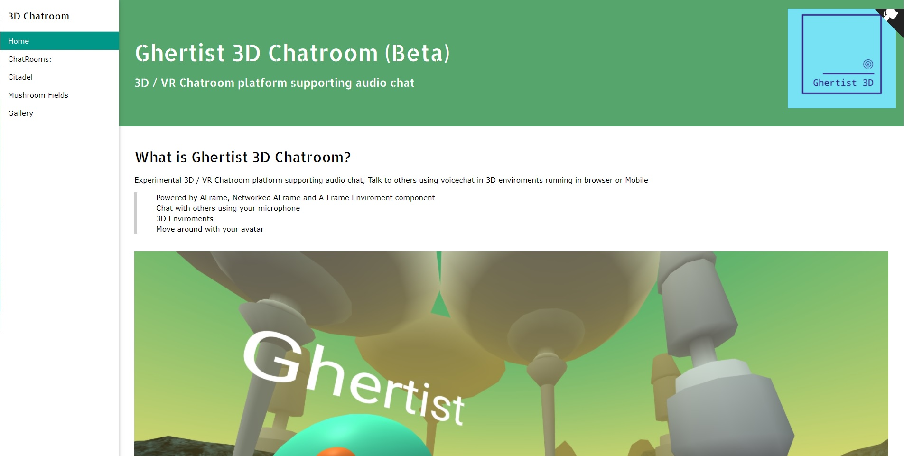
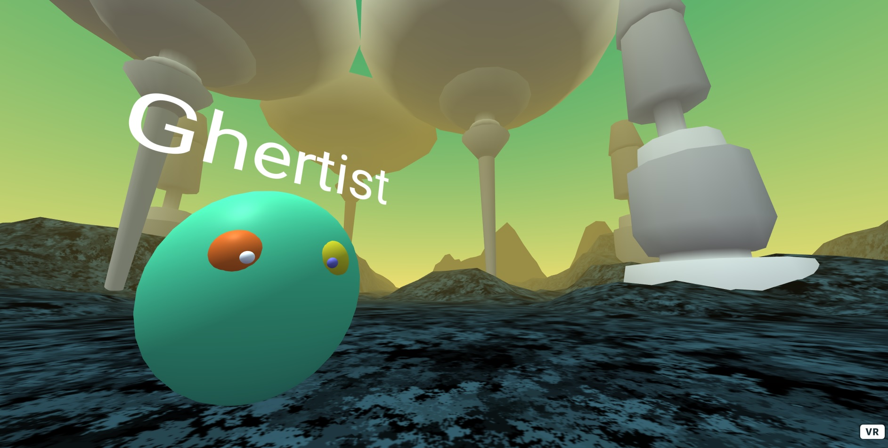
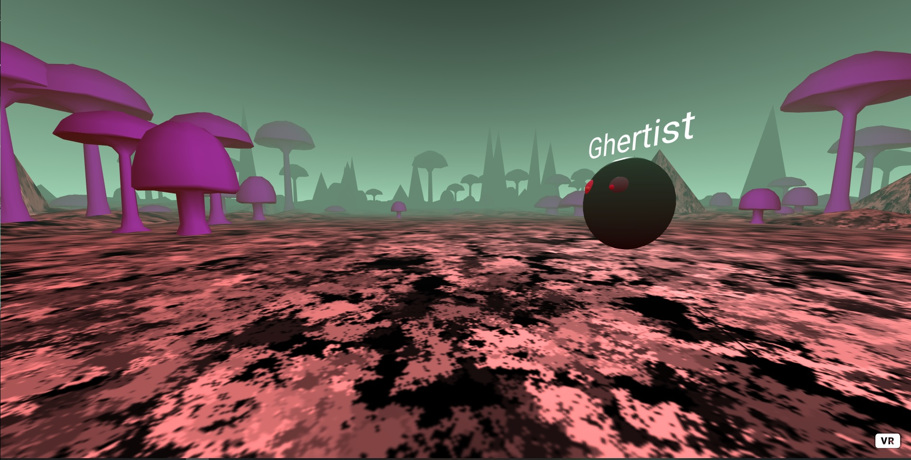
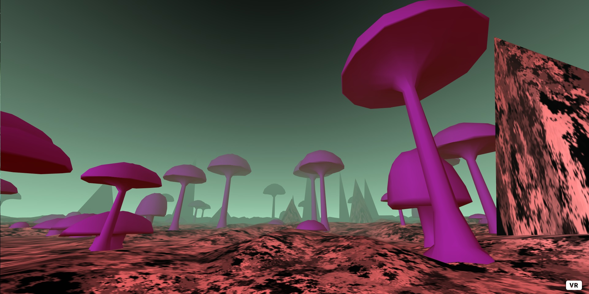

# Chat3D Chatroom AFrame
 Project to create a 3D chatroom with audio support and generated enviroments - using networked-aframe and aframe-environment-component with multicam support. Supports up to 6 users per session. v

### Dependencies 
- A-Frame
- Networked-aframe
- aframe-enviroment-component

### Screengrabs 

